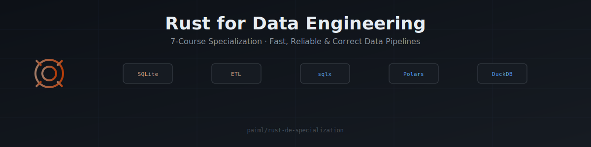

# Rust for Data Engineering

  

**Fast, Reliable & Correct Data Pipelines in Rust.** A [31-Course Coursera Specialization](https://www.coursera.org/specializations/rust) that takes you from Rust fundamentals through embedded databases, async ETL, analytics, GUI work, parallelism, and compile-time correctness — all the way to formal-contract-gated production pipelines.

> 🎓 **Enroll on Coursera** → <https://www.coursera.org/specializations/rust>

## Table of Contents

- [What You'll Learn](#what-youll-learn)
- [Courses](#courses)
- [Recommended Learning Sequence](./SEQUENCE.md) — phased re-ordering of the 31 courses by dependency
- [Capstone Projects](#capstone-projects)
- [Instructors](#instructors)
- [License](#license)

## What You'll Learn

The curriculum is organized into five tracks that mirror the modern data engineering stack:

- **Foundations & Systems** — Rust fundamentals, Linux desktop, terminal workflows, CLI tools, and shipping production binaries.
- **Data, Databases & Algorithms** — SQLite, MySQL, Postgres, DuckDB, Polars, graph algorithms, and RAG pipelines.
- **Cloud & DataOps** — Serverless on AWS, GCP, monitoring & automation, CI/CD, and containers for data pipelines.
- **AI & Adjacent Languages** — Claude-driven workflows, Zig for systems work, and WebAssembly.
- **Methodology & Ethics** — Data ethics, Agile with AI, design by provable contracts, and Big-O thinking from Python to Rust.

## Courses

The full 31-Course catalog in Coursera dashboard order. 🟢 **Launched** = live on Coursera; ⚪ **Draft** = in production.

> ⚠️ This is publication order, not learning order. For a phased, dependency-aware path through the spec, see [**SEQUENCE.md**](./SEQUENCE.md).

| # | Course | Status | Instructor | Companion Repo |
|---|---|---|---|---|
| 1 | [Rust from Zero](https://www.coursera.org/learn/rust) | 🟢 Launched | Liam Parker | — |
| 2 | [SQLite for Rust](https://www.coursera.org/learn/sqlite) | 🟢 Launched | Alfredo Deza | [paiml/rust-for-sqlite](https://github.com/paiml/rust-for-sqlite) |
| 3 | [ETL Pipelines with Rust](https://www.coursera.org/learn/etl) | 🟢 Launched | Noah Gift | [this repo](https://github.com/paiml/rust-de-specialization) |
| 4 | [Linux Desktop from Zero](https://www.coursera.org/learn/linux) | 🟢 Launched | Noah Gift | — |
| 5 | [Polars from Zero](https://www.coursera.org/learn/polars) | 🟢 Launched | Alfredo Deza | [paiml/polars-fundamentals](https://github.com/paiml/polars-fundamentals) |
| 6 | [Rust Serverless](https://www.coursera.org/learn/lambda) | 🟢 Launched | Noah Gift | [paiml/rust-serverless-data-engineering](https://github.com/paiml/rust-serverless-data-engineering) |
| 7 | [Data Ethics](https://www.coursera.org/learn/ethical) | 🟢 Launched | Noah Gift | — |
| 8 | [Agile With AI](https://www.coursera.org/learn/agile-with-ai) | 🟢 Launched | Noah Gift | — |
| 9 | [Zig from Zero](https://www.coursera.org/learn/zig) | 🟢 Launched | Noah Gift | [paiml/zig-from-zero](https://github.com/paiml/zig-from-zero) |
| 10 | [Rust GUI from Zero](https://www.coursera.org/learn/gui) | 🟢 Launched | Noah Gift | [paiml/rust-gui-from-zero](https://github.com/paiml/rust-gui-from-zero) |
| 11 | [Terminal from Zero](https://www.coursera.org/learn/terminal) | 🟢 Launched | Noah Gift | — |
| 12 | [Rust on GCP](https://www.coursera.org/learn/rust-gcp) | 🟢 Launched | Noah Gift | — |
| 13 | [Shipping Rust](https://www.coursera.org/learn/ship) | 🟢 Launched | Noah Gift | [paiml/shipping-rust](https://github.com/paiml/shipping-rust) |
| 14 | Claude from Zero | ⚪ Draft | Noah Gift | [paiml/claude-from-zero](https://github.com/paiml/claude-from-zero) |
| 15 | [Rust CLI from Zero](https://www.coursera.org/learn/cli) | 🟢 Launched | Alfredo Deza | [paiml/rust-cli](https://github.com/paiml/rust-cli) |
| 16 | [Graph Algorithms with Rust](https://www.coursera.org/learn/graph) | 🟢 Launched | Noah Gift | [paiml/rust-graph-algorithms](https://github.com/paiml/rust-graph-algorithms) |
| 17 | [MySQL from Zero](https://www.coursera.org/learn/queries) | 🟢 Launched | Alfredo Deza | [paiml/mysql-from-zero](https://github.com/paiml/mysql-from-zero) |
| 18 | [Postgres from Zero](https://www.coursera.org/learn/postgres) | 🟢 Launched | Alfredo Deza | [paiml/postgres-from-zero](https://github.com/paiml/postgres-from-zero) |
| 19 | [RAG from Zero](https://www.coursera.org/learn/rag) | 🟢 Launched | Noah Gift | [paiml/rag-from-zero](https://github.com/paiml/rag-from-zero) |
| 20 | [DuckDB from Zero](https://www.coursera.org/learn/duckdb) | 🟢 Launched | Alfredo Deza | [paiml/duckdb-from-zero](https://github.com/paiml/duckdb-from-zero) |
| 21 | Valkey from Zero | ⚪ Draft | Noah Gift | [paiml/valkey-from-zero](https://github.com/paiml/valkey-from-zero) |
| 22 | [Rust for Data Source Monitoring and Automation](https://www.coursera.org/learn/monitoring) | 🟢 Launched | Alfredo Deza | [this repo](https://github.com/paiml/rust-de-specialization) |
| 23 | [Rust DataOps: CI/CD and Containers for Data Pipelines](https://www.coursera.org/learn/pipeline) | 🟢 Launched | Alfredo Deza | [this repo](https://github.com/paiml/rust-de-specialization) |
| 24 | HelixDB from Zero | ⚪ Draft | Noah Gift | [paiml/helixdb-from-zero](https://github.com/paiml/helixdb-from-zero) |
| 25 | Design by Provable Contracts | ⚪ Draft | Noah Gift | [paiml/design-by-provable-contracts](https://github.com/paiml/design-by-provable-contracts) |
| 26 | IaC from Zero | ⚪ Draft | Noah Gift | [paiml/iac-from-zero](https://github.com/paiml/iac-from-zero) |
| 27 | TUI from Zero | ⚪ Draft | Noah Gift | [paiml/tui-from-zero](https://github.com/paiml/tui-from-zero) |
| 28 | WASM from Zero | ⚪ Draft | Noah Gift | [paiml/wasm-from-zero](https://github.com/paiml/wasm-from-zero) |
| 29 | Bash to Rust: From Zero | ⚪ Draft | Noah Gift | [paiml/bashrs-from-zero](https://github.com/paiml/bashrs-from-zero) |
| 30 | Big O Notation: Python to Rust | ⚪ Draft | Noah Gift | [paiml/big-o-python-to-rust](https://github.com/paiml/big-o-python-to-rust) |
| 31 | OO: Python to Rust | ⚪ Draft | Noah Gift | [paiml/oo-python-to-rust](https://github.com/paiml/oo-python-to-rust) |

> Draft courses are in production and will be linked to their Coursera landing pages as they launch.

## Capstone Projects

  

Every course includes a hands-on capstone that integrates all modules into a realistic scenario. Completed capstones make great portfolio artifacts to share on LinkedIn or GitHub. Browse the [`capstones/`](capstones/) directory for full project briefs.

Two courses ship **Playground Readings** — zero-install companion walkthroughs that run entirely on the [Rust Playground](https://play.rust-lang.org/), so you can master the core concepts in the browser before tackling the full capstone:

- [Course 1 — Rust from Zero](capstones/c01-capstone-reading.md): six lesson-aligned exercises covering Rust fundamentals.
- [Course 3 — ETL Pipelines with Rust](capstones/c03-capstone-reading.md): eight lesson-aligned sections on async pools, typed row deserialization, idempotent migrations, RAII-rollback transactions, and row-aligned validation.

## Instructors

- **[Noah Gift](https://github.com/noahgift)** — Founder, Pragmatic AI Labs · Duke University faculty
- **[Alfredo Deza](https://github.com/alfredodeza)** — Author and content creator · Python, Rust, DevOps, ML
- **Liam Parker** — Rust educator

## License

Course content © Pragmatic AI Labs. Code examples are released under the [MIT License](LICENSE).
